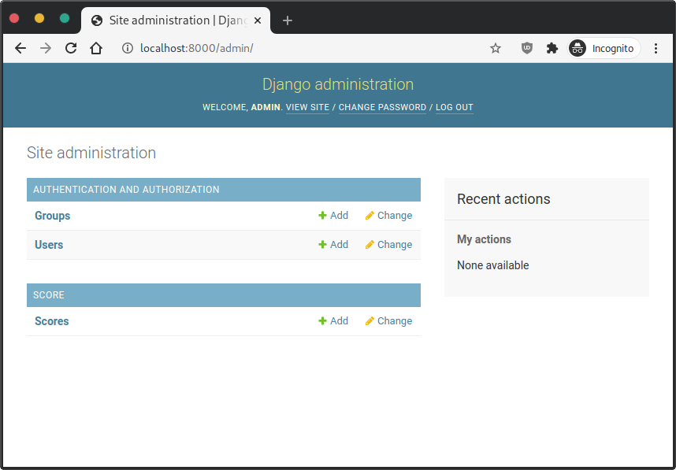
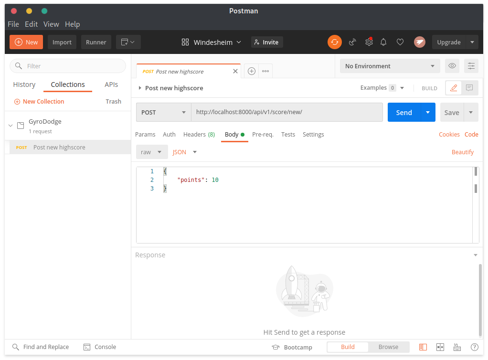
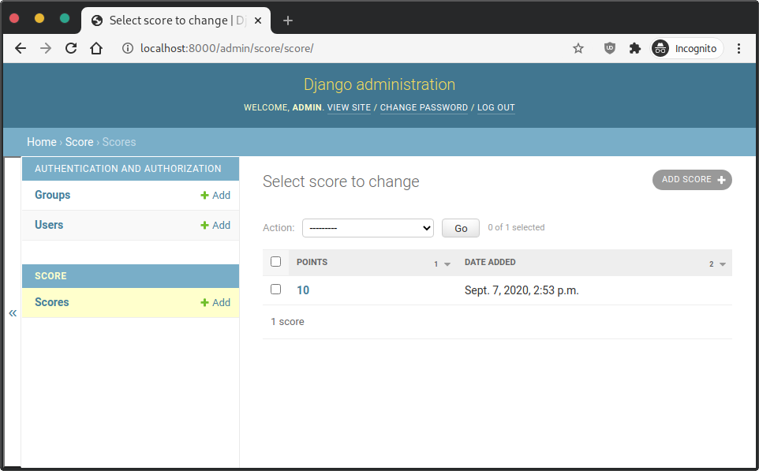

# GyroDodge score backend

This repository contains the source code for the GyroDodge score system.

## Requirements

- Python 3.6+
- [Postman](https://www.postman.com/downloads/) (for making API requests)

## Installation

### Create your virtualenv

Inside the project root, create a new virtualenv. A virtualenv is an isolated installation of Python.
This ensures that you can have multiple Python project without worrying about different project colliding with each other.

```sh
python3 -m venv venv
```

Activate the virtualenv.

Windows:

```sh
.\venv\Scripts\activate.bat
```

macOS / Linux:

```sh
./venv/bin/activate
```

### Install project dependencies with pip

```sh
pip3 install -r requirements.txt
```

### Migrate the database

Django manages the tables and columns in the database.
This project is configured to use sqlite by default.
Sqlite will store its database in a file called `db.sqlite3`.

Run migrations to create and populate the database:

```sh
python3 manage.py migrate
```

### Create your user account

You are almost there. Create your user account and follow the prompts.

```sh
python3 manage.py createsuperuser
```

### Start the server

Django comes with a webserver for development purposes.

This webserver should not be used to serve the applications on a real production server!

```sh
python3 manage.py runserver
```

### Navigating the admin

Now that the development server is running you should be able to access the admin panel.

[http://localhost:8000/admin/](http://localhost:8000/admin/)



After logging in with the credentials you created earlier, you should see a "Scores" link.
Click it to view all highscore submissions.

There should be none because you didn't create any yet.

### Submitting a highscore

We recommend installing [Postman](https://www.postman.com/downloads/) for an easier experience. This guide assumes you are using Postman.

1. Start Postman. Open the import wizard via the menu `File / Import...` option and choose the `GyroDodge.postman_collection.json` file included in this repository.

    In the right sidebar you should now see a GyroDodge folder with at least one item in it.

2. Open the 'Post new highscore' item by clicking it. Notice that it is a HTTP POST request to `http://localhost:8000/api/v1/score/new/`

3. Navigate to the Body tab. It should already contain a JSON payload:

    ```json
    {
        "points": 10
    }
    ```

    `points` should be the score you archieved while playing the GyroDodge game.



4. Now make sure you have the development server running and click 'Send'.
5. You should get a 200 OK response like this:

    ```json
    {
        "position": 1
    }
    ```

    `position` indicates your current position in the leaderboard.

6. Navigate to the score admin: [http://localhost:8000/admin/score/score/](http://localhost:8000/admin/score/score/).

    You should see your highscore has been submitted.



<hr />

## License

See [LICENSE](LICENSE)
